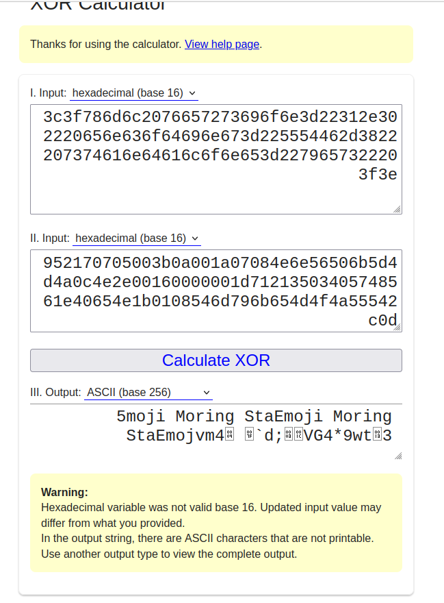
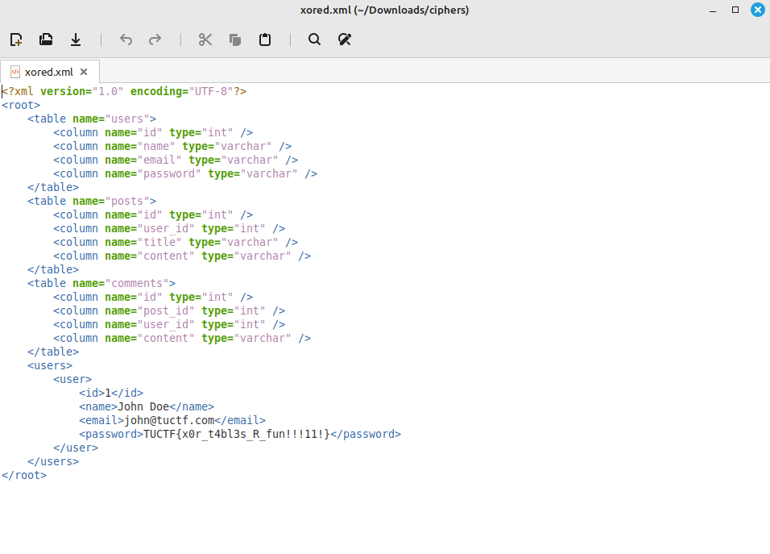

# tuctf 2023
## Table encryption

“You can't crack my file! I am the exclusive owner of the encryption key!”

## Premise of the challenge:

The extension of the file is .xml.enc
so we know that it is an xml file but has been encrypted through an unknown method.
The goal is to find the appropriate decryption method or key.


## The vulnerability

I started by checking the file header for xml and it was `<?xml version="1.0" encoding="UTF-8" standalone="yes" ?>`
This xml file header did not follow this pattern as it had been encrypted.
encrypted image files in CTFs tend to have their content bytes changed through simple encryption methods like XOR.
XOR encryption is a symmetric cipher, the key used to encrypt and decrypt are the same and so if we had the original set of bytes and the resulting set of bytes,
we could figure out the key.
The original set of bytes would be the xml file that has been encrypted and the part of the xml file that we know follows a fixed pattern is the header.
when XORing the xml file header with the encrypted xml file's header, you should get some clue as to what the key is.

## The Exploit

So to confirm my suspicions of the file having been encrypted using XOR, i used an XOR calculator  and quickly checked and i got a set of repeating values
which meant that the file had been encrypted through repeated XOR




(ignore the sloppy XOR)
The key here seems to be "Emoji Moring Sta"

So what i had to do next was simple, write a script to xor the key we got with the encrypted xml file


```from itertools import cycle

def xor(a, b):
    return bytes(x ^ y for x, y in zip(a, cycle(b)))

key = b'Emoji Moring Sta'

with open('table_encryption.xml.enc', 'rb') as f:
    data = f.read()

encrypted = xor(data, key)

with open('xored.xml', 'wb') as output:
    output.write(encrypted)
```

 the output is an xml file and we get the flag:



TUCTF{x0r_t4bl3s_R_fun!!!11!}